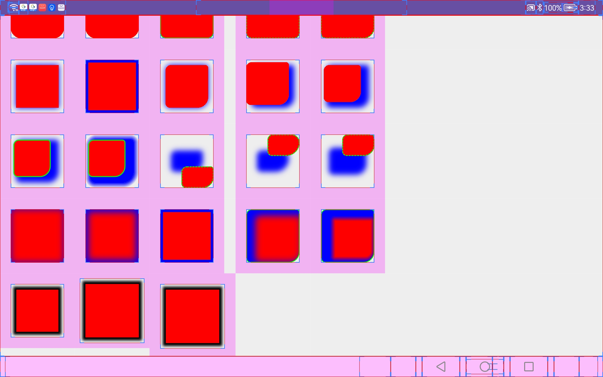

### 安卓阴影View

#### 效果图

#### 可使用[ShadowParams](ShadowView/src/main/java/com/github/xiaogqiong0v0/shadowview/ShadowParams.java)扩展大部分View
- [ShadowEditText](ShadowView/src/main/java/com/github/xiaogqiong0v0/shadowview/ShadowEditText.java)
- [ShadowFrameLayout](ShadowView/src/main/java/com/github/xiaogqiong0v0/shadowview/ShadowFrameLayout.java)
- [ShadowImageView](ShadowView/src/main/java/com/github/xiaogqiong0v0/shadowview/ShadowImageView.java)
- [ShadowLinearLayout](ShadowView/src/main/java/com/github/xiaogqiong0v0/shadowview/ShadowLinearLayout.java)
- [ShadowRelativeLayout](ShadowView/src/main/java/com/github/xiaogqiong0v0/shadowview/ShadowRelativeLayout.java)
- [ShadowTextView](ShadowView/src/main/java/com/github/xiaogqiong0v0/shadowview/ShadowTextView.java)
- [ShadowView](ShadowView/src/main/java/com/github/xiaogqiong0v0/shadowview/ShadowView.java)